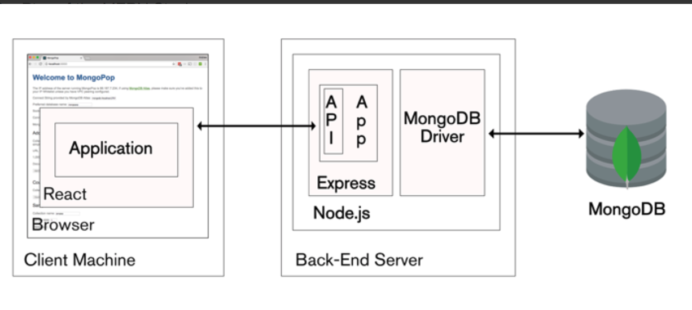

Instructions (Readme)

1.  Our MyUNLV application was developed using MERN stack technologies.
    This implementation is client side as opposed to server side. The
    site is currently running on Amazon AWS which proved to be a much
    bigger challenge than we originally intended. We decided to go the
    route of MERN and AWS because we wanted to learn something new as
    well as acquire skills that we’ll need in the real world as Computer
    Science professionals. Both of these technologies are
    widely implemented. MERN stack is a set of Open Source components
    that together, provide an end-to-end framework for building dynamic
    web applications, starting from the top (code running in
    the browser) to the bottom (database).

-   M stands for MongoDB: database- used by back-end application to
    store its data as JSON documents

-   E stands for Express.js: the back-end framework running on top of
    Node.js

-   R stands for ReactJS: the front-end web application framework, a
    JavaScript library developed by Facebook.

-   N stands for Node.js: JavaScript runtime environment that runs
    the back-end.

(note: API stands for application programming interface, it is the part
of the server that receives requests and sends response(s).)

2. MyUNLV Application URL:
[*http://myunlv-client.s3-website-us-west-1.amazonaws.com/*](http://myunlv-client.s3-website-us-west-1.amazonaws.com/)

3. Our project was developed on the revision control system, GitHUB, our
source code can be found here:
[*https://github.com/rickyhuang824/my-unlv-webapp*](https://github.com/rickyhuang824/my-unlv-webapp)

4. Once you download the source code from github, you can run our
project using a local environment after following the next steps below.

-   First, install MongoDB and Node, follow the instructions enclosed in
    the following links specific to your environment:

MongoDB: [*https://www.mongodb.com/*](https://www.mongodb.com/)

Node: [*https://nodejs.org/en/*](https://nodejs.org/en/)

-   Second: Install the Reactjs by entering following command in your
    terminal:

> npm i -g create-react-app
>
> (note: npm is the node package manager which is installed when you
> install Node)

-   Third: Install the Robo 3T which is the GUI for MongoDB:

[*https://robomongo.org/*](https://robomongo.org/)

-   Fourth: Open two additional terminal windows for a total of three:

    -   In the first terminal, type the following command in the root
        directory:

> mongod
>
> (note: this will open the MongoDB default port: 207107)

-   In the second terminal, navigate to the “server” directory inside
    the folder called “my-unlv” and run following command:

> npm start
>
> (note: the definition of this command is in package.json file)

-   In the third terminal, navigate to “client” directory inside the
    folder called “my-unlv” and run the following command:

> npm start
>
> (note: this will run the front-end (browser side) and you should see
> our web-application open up in a new browser window)
>
> Credentials to Login to MyUNLV
>
> NSHE: 200
>
> PW: 123
>
> NSHE: 300
>
> PW:123
